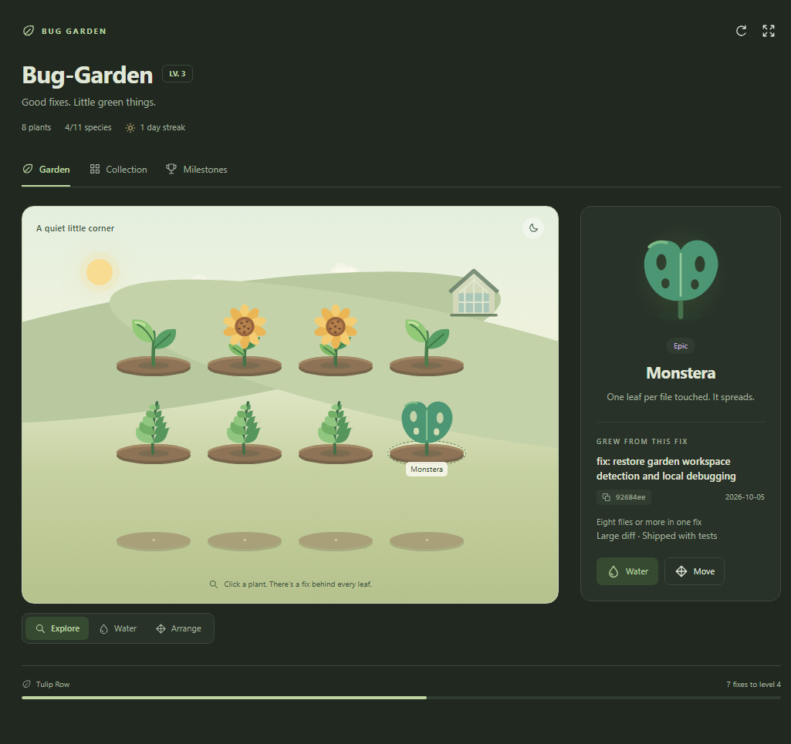

# Bug Garden

> Every bug you fix makes something grow.

Bug Garden is a Visual Studio Code extension that gamifies bug fixing. Each workspace
(project) owns its own virtual garden, and every commit that looks like a bug fix plants
a new specimen in it. Fix a typo and you get a Sprout. Ship a midnight hotfix across nine
files and something much rarer takes root.

Everything runs locally: no source code leaves your machine, and the extension never talks
to an external service.

The garden is an illustrated landscape with eleven plant species, a greenhouse and day/night
scenery. Explore it in the sidebar, or open **Bug Garden: Open Full Garden** in an editor tab.



## Features

Current status per roadmap phase:

- [x] Phase 0 — Project bootstrap (TypeScript, lint, tests, structure)
- [x] Phase 1 — Garden domain (plants, rarities, deterministic generation)
- [x] Phase 2 — Git integration (commit detection and bug-fix classification)
- [x] Phase 3 — Persistence (per-workspace garden state)
- [x] Phase 4 — VS Code UI (Activity Bar, garden webview, plant details)
- [x] Phase 5 — Progression (garden level, stats, streak, rarest plant)
- [x] Phase 6 — Polish (illustrations, interactions, empty states, achievements)

Current features:

- A Bug Garden view in the Activity Bar.
- One independent garden per workspace/project.
- Detection of bug-fix commits, with duplicate protection.
- A plant catalogue with rarities (Common, Rare, Epic, Legendary).
- Plant details: name, rarity, date, originating commit, unlock reason.
- Garden summary: bugs fixed, plants discovered, level, streak, rarest plant.
- An interactive landscape: explore a plant, water it, drag it to another plot or use
  **Arrange** to pick a plant and then a destination. Occupied plots swap their plants.
- Saved plant placement and day/night scenery, independent for each project.
- A searchable species collection with rarity filters and hints for undiscovered plants.
- Milestone progress and an expanded editor view alongside the sidebar.

## Installation

Not published to the Marketplace yet. To run it locally, see
[Local development](#local-development).

## Local development

Requirements:

- Node.js 22.6 or newer
- npm
- VS Code 1.90 or newer

```bash
npm install        # install dev dependencies
npm run build      # compile TypeScript to out/
npm run watch      # compile on change
npm test           # run the test suite (Node's built-in runner)
npm run test:ui    # browser interaction checks and screenshots (local Chrome/Edge)
npm run lint       # run ESLint
npm run check      # type-check + lint + tests, in one go
npm run package    # build and produce bug-garden-<version>.vsix
```

Then select **Run Extension** in VS Code's Run and Debug view and press <kbd>F5</kbd>.
The Extension Development Host opens this repository through `.vscode/extension-dev.code-workspace`
with Bug Garden loaded. This separate workspace lets the test window use the same repository
as the editor window; VS Code otherwise skips a folder that is already open.
In that window, run **Bug Garden: Open Garden View** from the Command Palette. Existing
bug-fix commits become plants; **Bug Garden: Refresh Garden** re-scans without duplicates.
After changing the extension, restart the debug session to load the rebuilt code.
If an older development window is still open, close that window before pressing <kbd>F5</kbd>
so VS Code uses the current launch arguments.

For browser-only UI verification, `npm run test:ui` uses eight plants from this repository's real bug-fix history,
opens an isolated headless Chromium profile, and saves screenshots in `.vscode-test/`.
Set `BROWSER_PATH` if Chrome, Chromium or Edge is installed in a nonstandard location.
This checks the webview interactions with a simulated bridge; the VS Code clipboard, editor
panel and folder picker should also be checked in the Extension Development Host.

You can also install the produced `.vsix` with
`code --install-extension bug-garden-0.1.0.vsix`.

## Commands

| Command                      | Palette title                   | Description                                       |
| ---------------------------- | ------------------------------- | ------------------------------------------------- |
| `bugGarden.showGarden`       | `Bug Garden: Open Garden View`  | Focuses the Bug Garden view in the Activity Bar.  |
| `bugGarden.openGardenPanel`  | `Bug Garden: Open Full Garden`  | Opens the illustrated garden in an editor tab.   |
| `bugGarden.refreshGarden`    | `Bug Garden: Refresh Garden`    | Re-scans git history and updates every garden.    |

`package.json` is the authoritative list.

## Caring for your garden

**Explore** a plant to see its originating commit and copy its hash. **Water** gives a little
animated drink; plants, rarity, levels and achievements are earned through bug-fix commits.
**Arrange** works with clicks or the keyboard: choose a plant, then another plot. Press
<kbd>Escape</kbd> to cancel. Drag and drop is also available. Gardens with more than twelve
plants have multiple beds with previous/next controls.

The moon/sun button changes the scenery. Placement and atmosphere survive reloads without
changing your Git history or earned garden. **Collection** shows discovered and undiscovered
species, and **Milestones** shows your progress. The interface supports light and dark themes,
visible keyboard focus, live action feedback and reduced-motion preferences.

## How it works today

1. On activation, every workspace folder is checked for a git repository.
2. `git log` is read (read-only, no shell, no network) and each commit subject is classified.
3. Bug-fix commits that the garden has not seen become plants, deterministically from the
   commit hash, and are stored in VS Code's workspace state.
4. The view refreshes automatically when `.git/HEAD` moves, so committing a fix makes a plant
   appear without touching anything else.

## Architecture at a glance

```text
git history ──► commitParser ──► bug-fix classifier ──► plantGenerator ──► gardenManager
                                                                            │
                                             storageService (workspace state)│
                                                                            ▼
                                                            webview (garden + details)
```

- `src/git` reads local history and decides what counts as a bug fix.
- `src/garden` turns a fix into a plant using deterministic, hash-seeded rules.
- `src/storage` persists each workspace garden in VS Code's own storage.
- `src/webview` renders the garden; `src/extension.ts` only wires things together.

Full details in [docs/ARCHITECTURE.md](docs/ARCHITECTURE.md), plant rules in
[docs/PLANT_SYSTEM.md](docs/PLANT_SYSTEM.md), and the reasoning behind the big choices in
[docs/DECISIONS.md](docs/DECISIONS.md).

## Roadmap

- **Phase 0 — Bootstrap.** Scaffolding, tooling, tests, docs. ✅
- **Phase 1 — Garden domain.** Models, plant catalogue, rarity calculation, deterministic
  generation. ✅
- **Phase 2 — Git integration.** Repository detection, commit parsing, bug-fix
  classification, duplicate prevention. ✅
- **Phase 3 — Persistence.** Garden state per workspace, versioning/migrations. ✅
- **Phase 4 — VS Code UI.** Activity Bar container, webview, plant details. ✅
- **Phase 5 — Progression.** Level, statistics, streak, rarest plant. ✅
- **Phase 6 — Polish.** Illustrated scenes, interactions, empty states, achievements. ✅

## Contributing

Bug Garden is developed with strict Git discipline: one branch per logical change, small
Conventional Commits, and tests plus documentation included in the same branch. Read
[CONTRIBUTING.md](CONTRIBUTING.md) before opening a pull request.

## License

[MIT](LICENSE)
